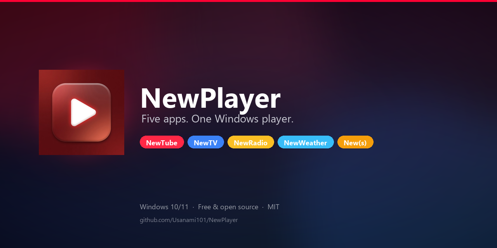
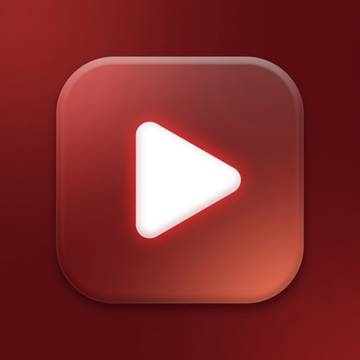
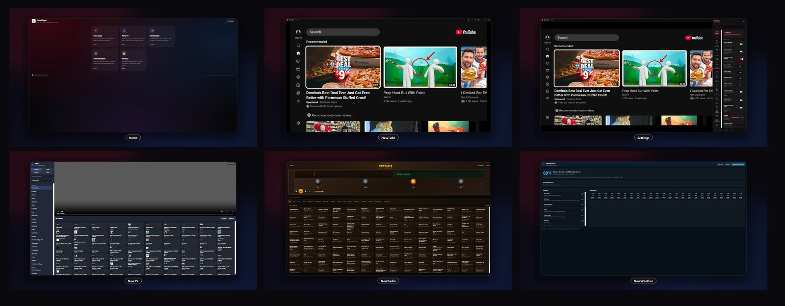
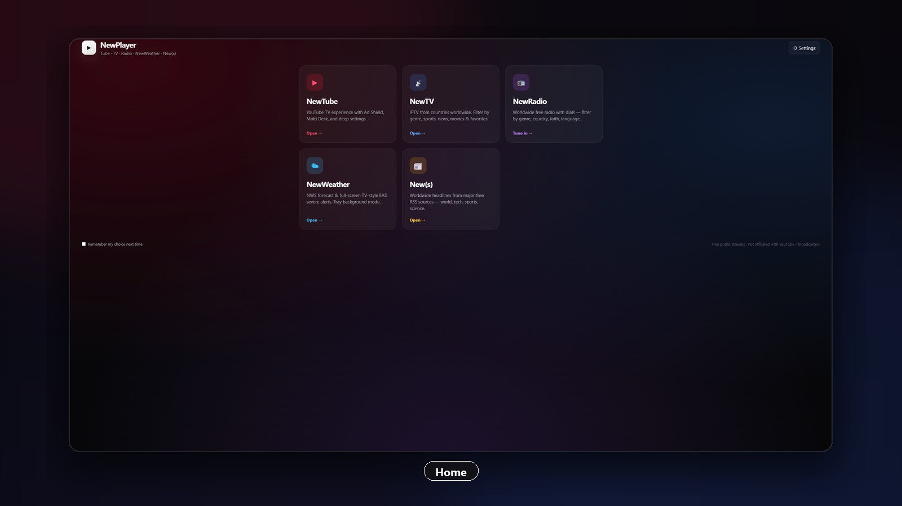
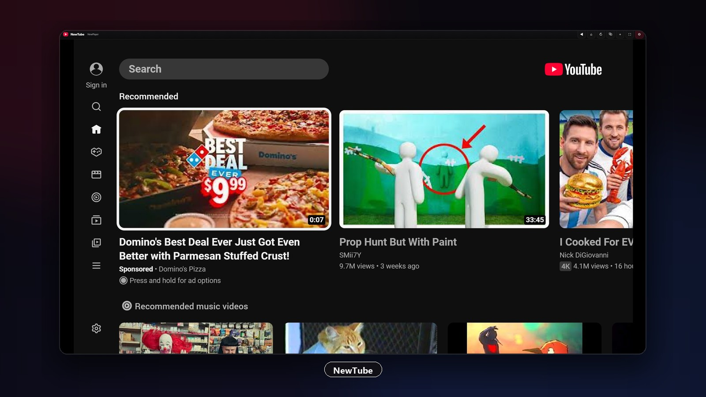
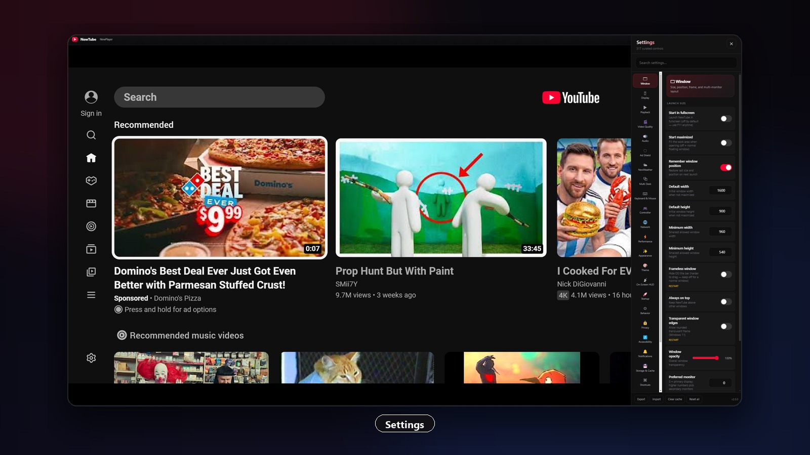
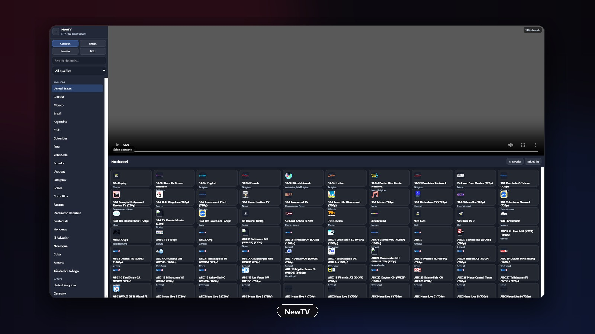
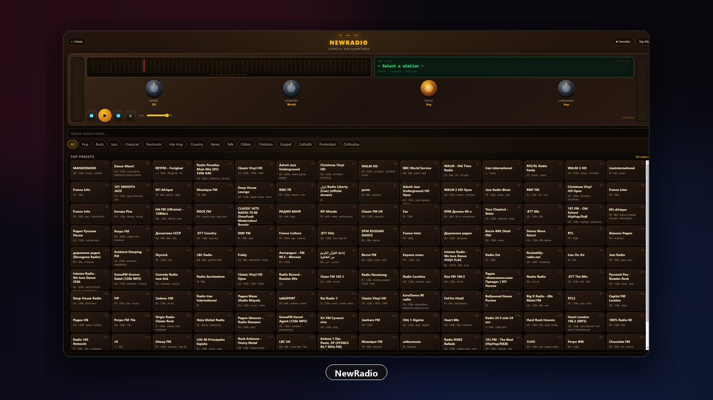
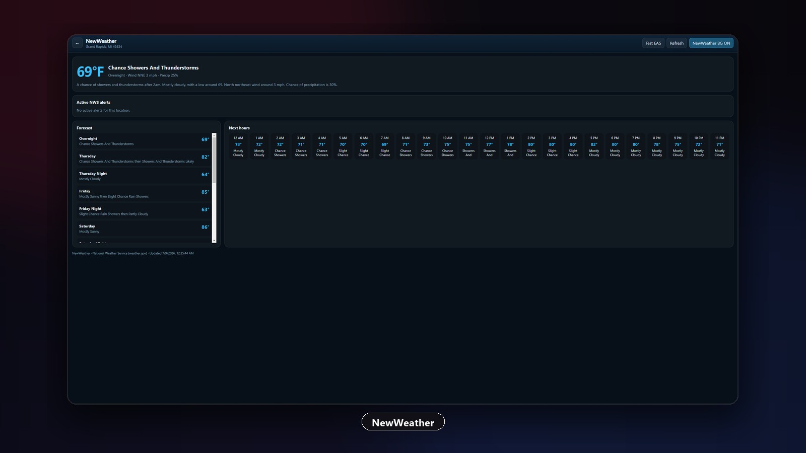
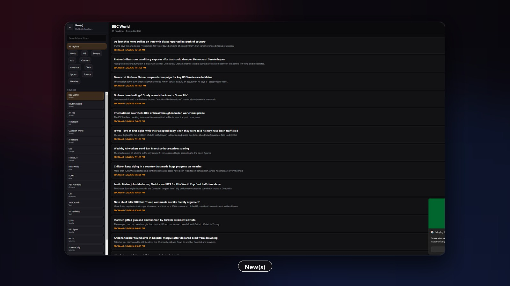

<p align="center">
  
</p>

<p align="center">
  
</p>

<h1 align="center">NewPlayer</h1>

<p align="center">
  <strong>Five apps. One Windows desktop player.</strong><br/>
  NewTube · NewTV · NewRadio · NewWeather · New(s)
</p>

<p align="center">
  <a href="#download">Download</a> ·
  <a href="#features">Features</a> ·
  <a href="#build-from-source">Build</a> ·
  <a href="#license">License</a>
</p>

---

## Download

| Package | Description |
|---------|-------------|
| **NewPlayer-Setup-x64.exe** | Recommended Windows installer (Start Menu, shortcuts, uninstaller) |
| **NewPlayer-Portable-x64.exe** | Portable — no install required |

Grab the latest files from the **[Releases](../../releases)** page of this repository.

> Windows may show SmartScreen on first run (unsigned builds). Choose **More info → Run anyway** if you trust the build you downloaded.

---

## Features

### NewTube
Premium **YouTube TV** shell for Windows — smart-TV user agents, Ad Shield, Multi Desk (multiple players, per-window mute, multi-monitor), deep settings, and a modern desktop chrome.

### NewTV
**IPTV** browser powered by free public playlists (iptv-org): countries, genres (movies, sports, news, kids…), quality filters, favorites, and custom M3U URLs. HLS playback via hls.js.

### NewRadio
Worldwide **free internet radio** with a wood-cabinet dial UI. Filter by **genre**, **country**, **faith/religion**, and **language**. Favorites and search. Powered by [Radio Browser](https://www.radio-browser.info/).

### NewWeather
**US National Weather Service** forecast + active alerts. Optional tray **background** mode. Severe weather can trigger a full-screen **TV-style EAS** takeover (dual-tone 853/960 Hz attention signal + real NWS text). Dismiss after 30s or when speech finishes.

### New(s)
**Worldwide headlines** from free public RSS sources (BBC, Guardian, Al Jazeera, NPR, tech, sports, science…). Filter by region/source and open stories in your browser.

---

## Screenshots

<p align="center">
  
</p>

| | |
|:--:|:--:|
|  |  |
| **Home** | **NewTube** |
|  |  |
| **Settings** | **NewTV** |
|  |  |
| **NewRadio** | **NewWeather** |
|  | |
| **New(s)** | |

---

## Requirements

- **Windows 10/11** x64  
- Internet connection (streaming, NWS, news, radio)  
- For development: **Node.js 18+**, npm  

---

## Build from source

```bash
# Clone
git clone https://github.com/Usanami101/NewPlayer.git
cd NewPlayer

# Install
npm install

# Run in dev
npm start

# Build installer + portable into release/
npm run dist
```

| Script | Output |
|--------|--------|
| `npm start` | Launch Electron app |
| `npm run build` | electron-builder Windows targets |
| `npm run dist` | Build + stage `release/` folder |
| `npm run build:portable` | Portable EXE only |
| `npm run build:installer` | NSIS installer only |

Installer assets (sidebar/header) are generated with Python + Pillow:

```bash
pip install pillow
npm run assets:installer
```

---

## Project layout

```
NewPlayer/
├── assets/              # App icon
├── build/               # Installer icons, NSIS hooks, asset scripts
├── src/
│   ├── main/            # Electron main process
│   ├── renderer/        # UI for each mode + EAS screen
│   ├── data/            # IPTV countries, radio filters, etc.
│   └── settings/        # Settings catalog
├── release/             # Staged README (binaries via GitHub Releases)
├── package.json
└── LICENSE.txt
```

---

## Privacy & legal notes

- **NewTube** is an independent shell around YouTube’s TV web UI. Not affiliated with Google/YouTube.  
- **NewTV / NewRadio / New(s)** use **free public** streams and feeds. Availability varies; some links die over time.  
- **NewWeather** uses official **NWS** (`api.weather.gov`) data (United States). EAS display is a personal warning UI, not an official broadcaster encoder.  
- Respect each service’s terms of use and local laws.

---

## Contributing

See [CONTRIBUTING.md](CONTRIBUTING.md). Bug reports and PRs welcome.

---

## Changelog

See [CHANGELOG.md](CHANGELOG.md).

---

## License

[MIT](LICENSE.txt) © NewPlayer contributors.
